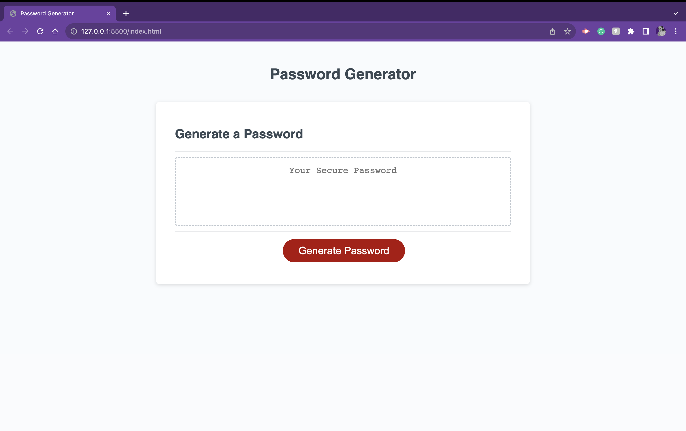
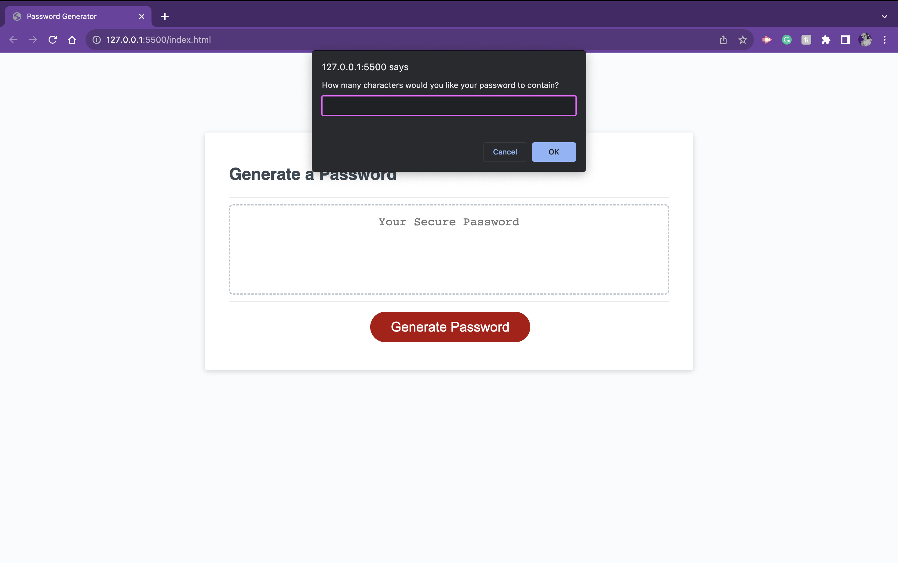
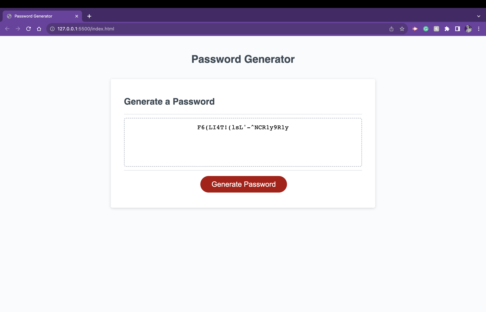

# Password Generator
  
>  This application enables users to generate random passwords based on criteria that they’ve selected. This app runs in the browser and features updated HTML and CSS powered by JavaScript code. It has a responsive user interface that adapts to multiple screen sizes.   

## Usage

* After clicking the red 'Generate Password' button, you will be prompt to choose the length of your password, as well as choose desired character types by clicking the 'OK' button.

* Once you have cycled through all of the confirmation prompts, your new password will appear in the box.

## Deployed Application
View it live here:
[here](https://rugbyveronica.github.io/new-password/)

## Changes Made

1. Included arrays for the characters needed.
2. Functions and variables with conditions to make sure the generator cycles through.
3. Included the ability for long and ever-changing passwords.
4. Created repository
5. Push data to the repository
6. Launched page.
7. Added SEO to HTML out of habit for good searches.